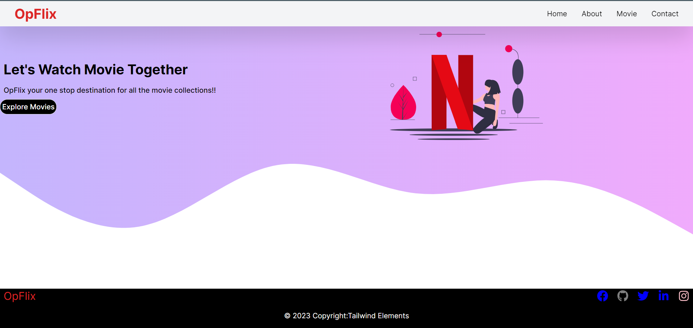
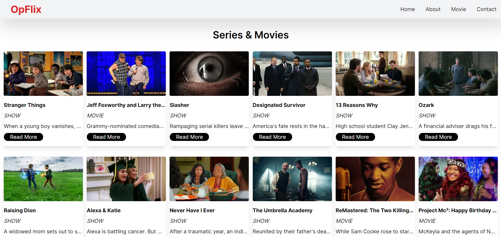
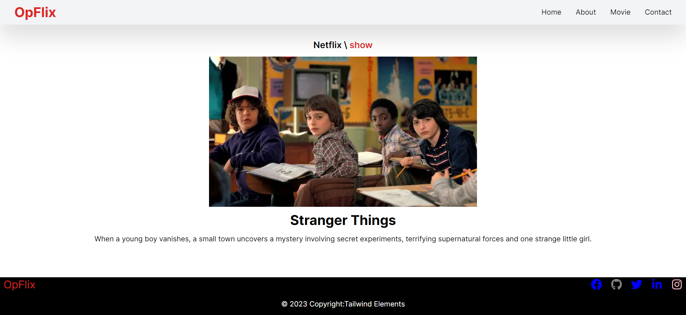
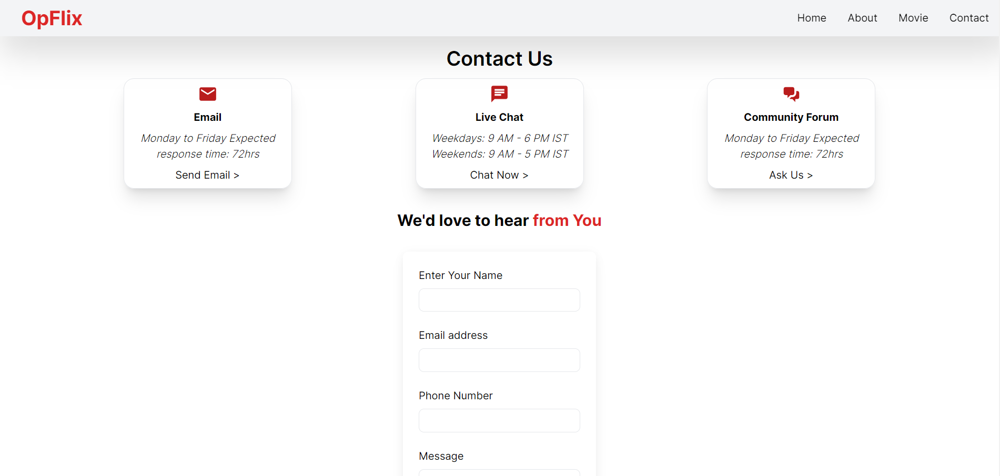
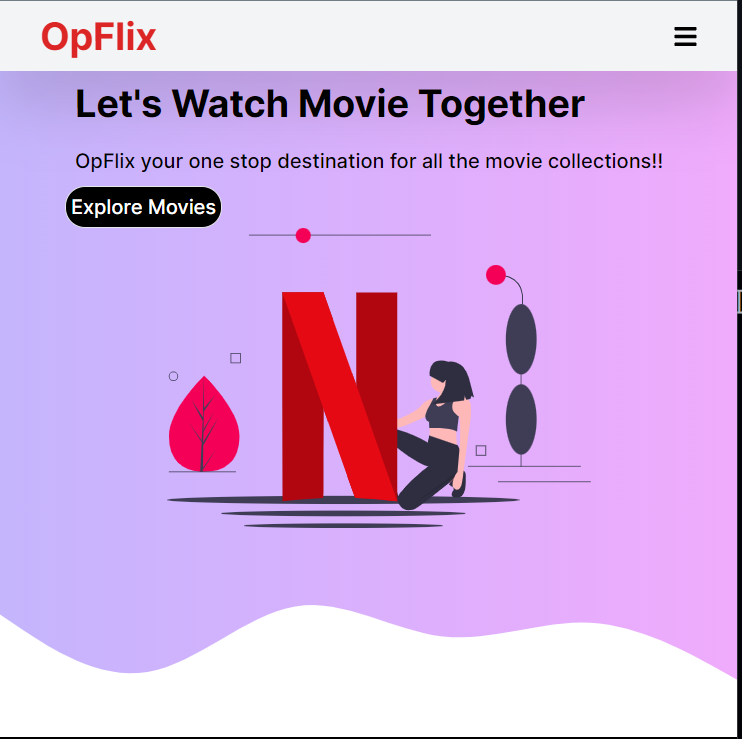
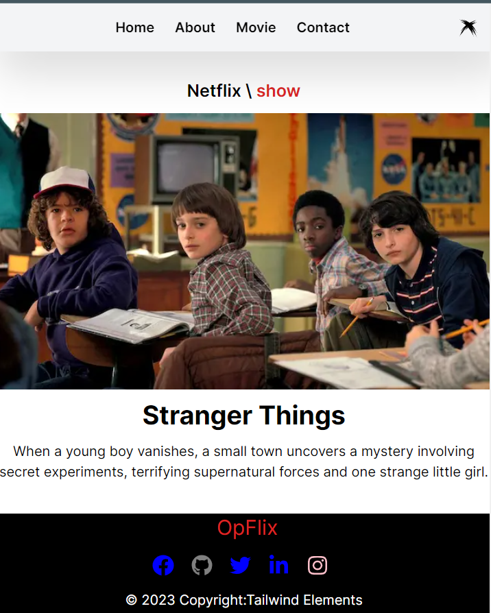

# OPFLIX (IMDB Website)

<p align="justify">This Website focuses on Next.js 13 features along with RAPID API (for movies) to showcase movies and web series. Server side rendering increases the performance and SEO.</p>

# Images:
<div align="center">




</div>

# Responsive Design:
<div align="center">



</div>

# TECH STACK USED:

- Framework: [Next.js](https://nextjs.org/)
- CSS Framework: [Tailwind CSS](https://tailwindcss.com/)
- MONGODB: [MongoDb](#)
- RAPID API: [RAPID API](#)

## Next.js

Next.js is a popular React framework for building server-side rendered (SSR) and static websites. It provides a great developer experience with features like automatic code splitting, server-side rendering, and static site generation.

With Next.js, you can easily create dynamic web applications and take advantage of powerful optimizations like incremental static regeneration and automatic caching.

Learn more about Next.js [here](https://nextjs.org/).

## Tailwind CSS

Tailwind CSS is a highly customizable CSS framework that provides a utility-first approach to styling. It allows you to rapidly build modern, responsive interfaces by composing small utility classes.

With Tailwind CSS, you can easily create and maintain consistent designs across your application. It provides a wide range of pre-built utility classes for styling elements, responsive layouts, and more.

Learn more about Tailwind CSS [here](https://tailwindcss.com/).

## MongoDB Installation

To install MongoDB, follow the steps below:

1. Go to the official MongoDB website at [https://www.mongodb.com](https://www.mongodb.com).

2. Click on the "Try Free" button or navigate to the "Downloads" section.

3. Choose the appropriate version of MongoDB for your operating system and click on the download link.

4. Follow the installation instructions specific to your operating system. MongoDB provides detailed installation guides for various platforms, such as Windows, macOS, and Linux.

5. Once the installation is complete, you can start using MongoDB.

## MongoDB Setup

After installing MongoDB, you may need to perform some initial setup:

1. Start the MongoDB server by running the following command in your terminal or command prompt:

   ```bash
   mongod
   ```

# Deployed on Vercel:
<div align="left">
<p>The Website had been deployed on vercel platform</p><a href="https://op-flix-id6s.vercel.app/">Live Demo</a>
</div>

<br>


# Installation

To install the code from this GitHub repository, follow the steps below:

1. Clone the repository using Git:

   ```bash
   git clone https://github.com/your-username/your-repository.git
   ```
    Replace your-username with your GitHub username and your-repository with the name of the repository you want to clone.

2. Navigate to the project directory:
   ```bash
   cd your-repository
   ```
   Change directory to the cloned repository.

3. Install any required dependencies:
   ```bash
   # Using npm
    npm install

    # Using yarn
    yarn install

   ```
   This command will install any necessary dependencies for the project. Make sure you have Node.js and the package manager (npm or yarn) installed on your system.

4. Start using the code:
   You can now start using the code from the repository according to the project's documentation or instructions. Refer to any provided README or documentation files for more information. 
